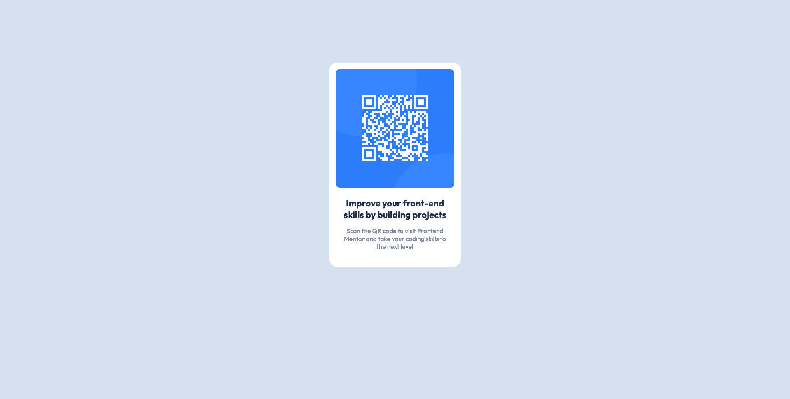

# Qr-code-FrontendMentor

FrontEnd Mentor Challenge

# Welcome ! 👋

## Screenshot

## Available scripts

In the project director, you can run :

### `npm install`

### `yarn start`

## My process

### Built width :

- HTML / CSS
- QrCode.JS to generate the QrCode
- [Parcel](https://parceljs.org/) - Build tool

## Author

- Frontend Mentor - [@Alexandre-st](https://www.frontendmentor.io/profile/Alexandre-st)
- Twitter - [@a_saintprix](https://twitter.com/a_saintprix)
